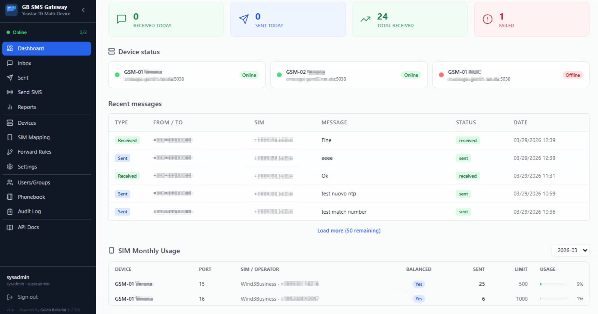
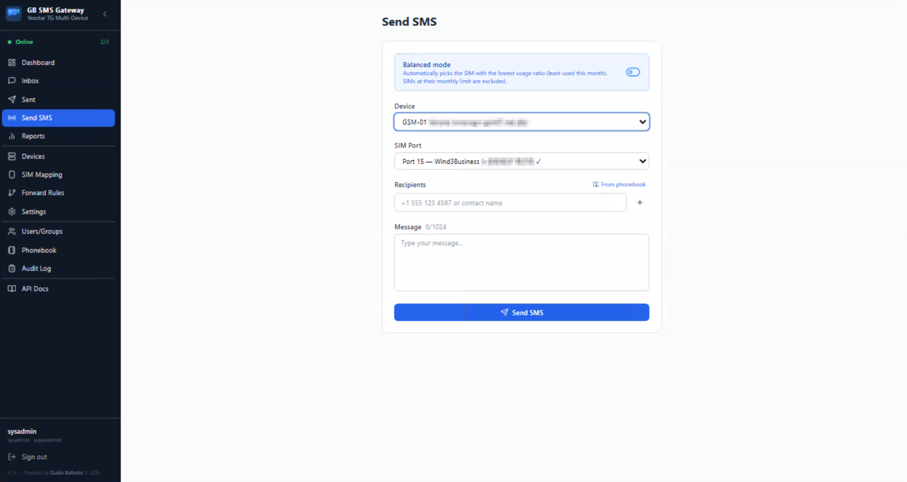
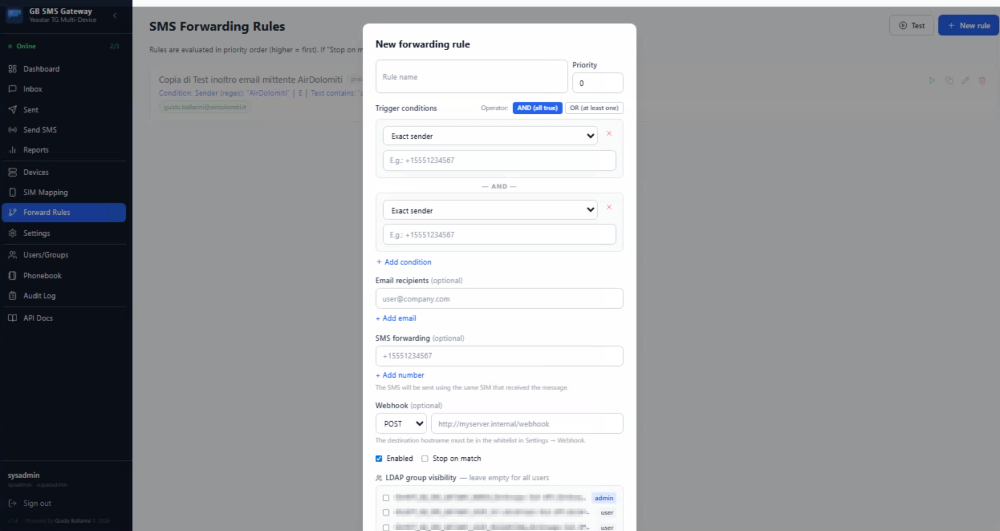
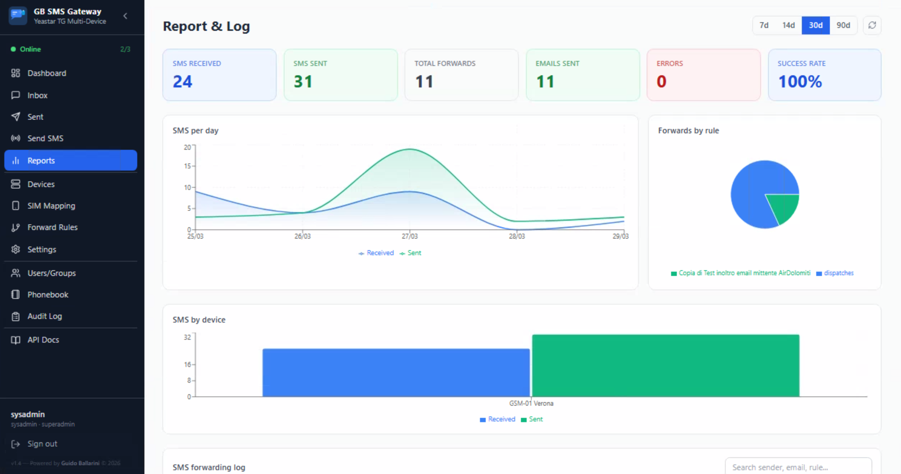
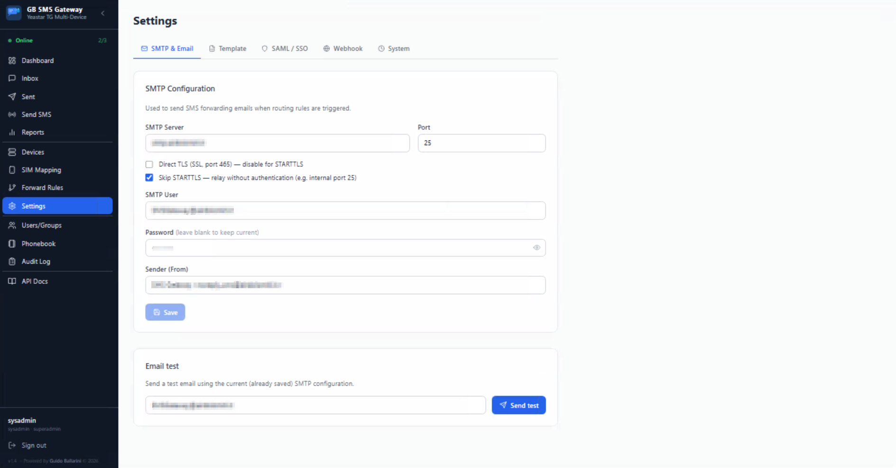
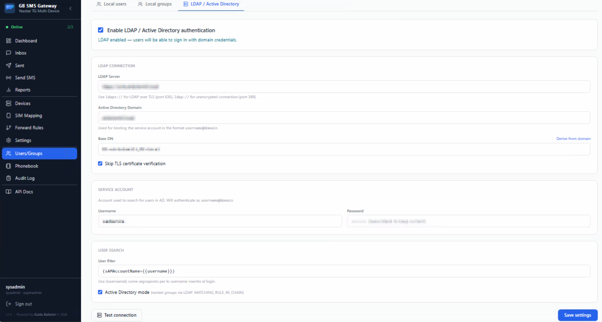
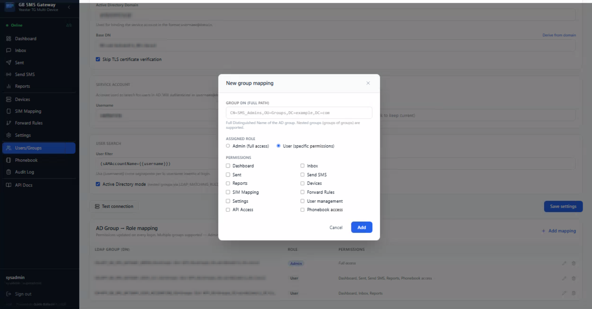
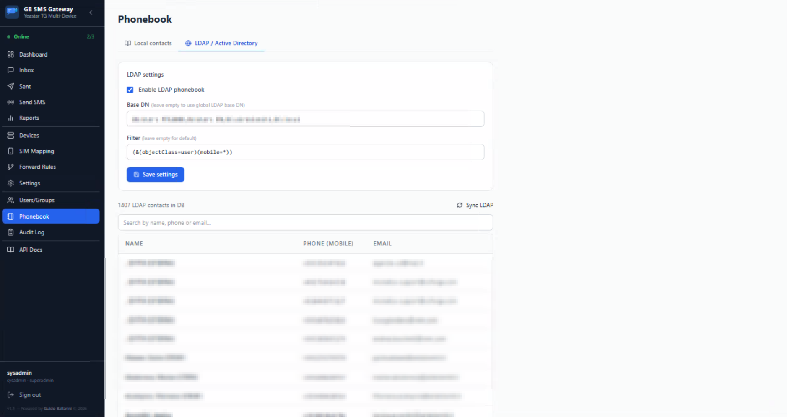
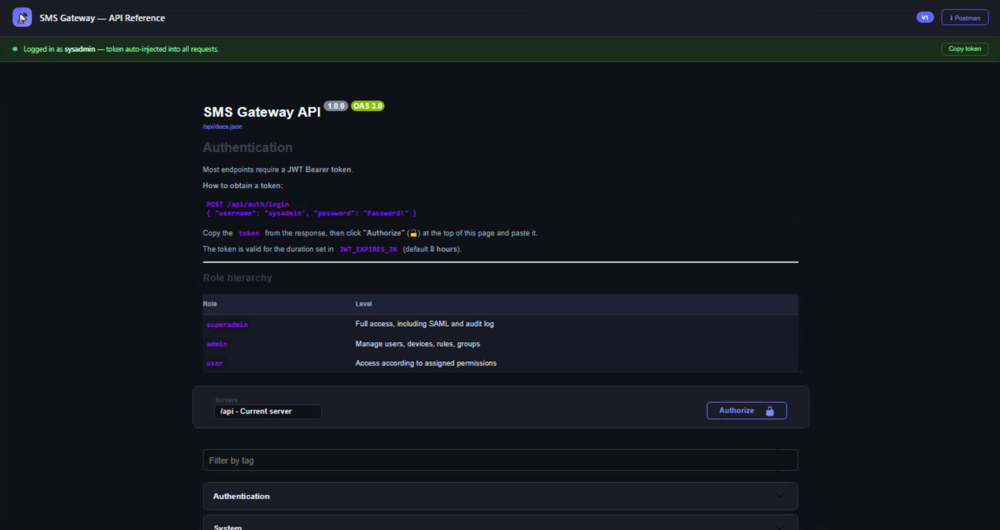

# GB SMS Gateway — SMS Management System for Yeastar TG1600


---

## 💶 Support the project

If you find this project useful, buy me a coffee! ☕

[](https://buymeacoffee.com/guidoballau)
[](https://www.paypal.com/donate/?hosted_button_id=8RF28JBPLYASN)

⭐ If you like the project, leave a star! ⭐

---
## 📋 Description

**GB SMS Gateway** is a complete system for managing and monitoring SMS messages received and sent through **Yeastar TG1600** GSM gateways. It provides real-time message viewing, automatic email forwarding rules, and user management with local, LDAP/Active Directory, and SSO authentication.

Ideal for organizations using Yeastar GSM gateways that want to centralize SMS reception with granular AD group-based visibility.

---

### ✨ Key Features

- 📊 **Real-time Dashboard** — Daily statistics: SMS received, sent, failed; device connection status; SIM monthly usage with per-SIM limit progress bars
- 📥 **SMS Inbox** — All inbound SMS with search, filter, and preview
- 📤 **Sent SMS** — Outbound message history with delivery status
- ✉️ **Send SMS** — Manual send form with device and SIM port selection, or **balanced auto-routing**
- 📡 **Device Management** — Add/edit Yeastar devices with AMI connection monitoring
- 🔌 **SIM Port Management** — View port status, carrier, IMEI, assigned SIM number; configure balanced pool and monthly send limit per SIM
- ⚖️ **Balanced SIM Load Balancing** — `port="auto"` routes each send to the SIM with the lowest usage ratio; monthly limit per SIM enforced automatically (saturated SIMs excluded)
- 📋 **Forwarding Rules** — Routing engine with multiple conditions (sender, text, regex), priority, stop-on-match, and email/SMS forwarding
- 👁️ **Group Visibility** — Each rule can restrict message visibility to authorized LDAP/AD group members only
- 📊 **Reports & Statistics** — SMS analysis by day, device, and rule with forwarding logs
- ⚙️ **SMTP Settings** — Mail server configuration and customizable HTML email template
- 👥 **User Management** — `superadmin`, `admin`, `user` roles with granular per-section permissions
- 🏘️ **Local Groups** — Create local user groups with permission inheritance
- 📜 **Audit Log** — Complete record of all operations (superadmin only)
- 🔐 **Authentication** — Local, LDAP/Active Directory, SSO (Authentik, NetScaler ADC, Nginx)
- 🔄 **WebSocket** — Real-time updates for new SMS and device status
- 📱 **PWA** — Installable as an app on desktop and mobile
- 🔏 **SAML 2.0 / Enterprise SSO** — Federated login via NetScaler, ADFS, or Azure AD (SP-initiated, configurable from UI)
- 📖 **Swagger UI / API Docs** — Interactive REST API reference at `/docs`, auto-authenticated when already logged in
- 📒 **Phonebook** — Local contacts (admin-managed) and LDAP/AD contacts (mobile attribute); contact picker for multi-recipient SMS send; contact names shown inline in message lists and detail views

---

## 📸 Screenshots

**Dashboard**


**Send SMS**


**Forward Rules**


**Reports**


**Settings**


**Users & Groups**


**Users & Groups — Permissions**


**Phonebook**


**API Docs (Swagger)**


---

## 🚀 Installation

### Option 1: Docker (Recommended)

**Prerequisites:**
- Docker and Docker Compose installed
- Available port: `4674` (web frontend)

**Quick deploy:**

```bash
# Clone the repository
cd /volume3/docker   # Synology NAS
# or: cd /opt/docker  # Linux VPS

git clone https://github.com/Gheben/GB_SMS_Gateway.git smsgateway
cd smsgateway

# Create the configuration file
cp .env.example .env

# Edit required variables
vi .env   # set JWT_SECRET and SUPERADMIN_PASSWORD

# Start the containers
docker compose up -d --build

# Check status
docker ps

# View logs
docker logs smsgateway-backend
docker logs smsgateway-frontend
```

Accedi all'applicazione su `http://localhost:4674`

---

**`docker-compose.yml` configuration:**

```yaml
services:
  init-dirs:        # creates ./data and ./logs on the host (Synology compat)
    image: alpine
    command: sh -c "mkdir -p /host/data /host/logs"

  backend:          # API + WebSocket, internal port 4673
    depends_on:
      init-dirs:
        condition: service_completed_successfully

  frontend:         # React UI via nginx, port 4674
    ports:
      - "${FRONTEND_PORT:-4674}:80"
```

Persistent volumes:
- `./data/smsgateway.db` — SQLite database (backup = copy this file)
- `./logs/app.log` — Application log

---

**Update:**

```bash
cd /volume3/docker/smsgateway
git pull
docker compose down
docker compose up -d --build
```

---

### Option 2: Manual installation (development)

**Prerequisites:**
- Node.js 22+ (required for `node:sqlite` built-in)
- npm

**Steps:**

```bash
git clone https://github.com/Gheben/GB_SMS_Gateway.git
cd GB-SMS-Gateway

# Backend
cd backend
npm install
cp .env.example .env   # configure variables
node --experimental-sqlite src/index.js

# Frontend (in another terminal)
cd frontend
npm install
npm run dev   # Vite dev server → http://localhost:3000
```

The frontend (Vite) runs on `http://localhost:3000` and proxies `/api` to the backend on `localhost:4673`.

---

## 🔑 First Login

On startup, the system automatically creates the super-administrator user:

- **Username**: `sysadmin` (configurable via `SUPERADMIN_USERNAME`)
- **Password**: `Password!` (configurable via `SUPERADMIN_PASSWORD`)

> ⚠️ **IMPORTANT**: Change the password immediately after first login! Set a long, random `JWT_SECRET` in `.env` before going to production.

---

## ⚙️ Configuration (`.env`)

```dotenv
# ─── Backend ────────────────────────────────────────────────────────
PORT=4673
LOG_LEVEL=info          # error | warn | info | debug
CORS_ORIGIN=*           # or: http://192.168.1.50:4674

# ─── Authentication ─────────────────────────────────────────────────
SUPERADMIN_USERNAME=sysadmin
SUPERADMIN_PASSWORD=Password!          # Change in production!
JWT_SECRET=change-with-long-random-string
JWT_EXPIRES_IN=8h                      # e.g. 8h, 1d, 7d

# ─── Frontend (Docker only) ─────────────────────────────────────────
FRONTEND_PORT=4674

# ─── SSO via proxy (optional) ─────────────────────────────────────
# SSO_ENABLED=true
# SSO_HEADER=X-Remote-User

# ─── Timezone (optional — can also be set via UI → Settings → System) ────────
# TZ=Europe/Rome         # IANA timezone identifier (initial default only)
#                        # ⚠ Priority: DB value (saved via UI) > .env TZ > system default.
#                        # Once saved via the UI the DB value overrides this on every restart.

# ─── LDAP Phonebook auto-sync (optional) ────────────────────────────────────
# LDAP_SYNC_INTERVAL_HOURS=6     # Repeat phonebook sync every N hours (default: 6)
```

> SMTP, LDAP, NTP and SAML are configured directly from the web interface → **Settings** and **User management**.

---

## 🔐 Authentication

### Local users
Credentials stored in the DB with bcrypt-hashed passwords (cost 12). Managed from the **User management** section.

### LDAP / Active Directory
Configurable from the UI → **User management → LDAP / Active Directory**:
- Bind with a service account
- User search via customizable filter (default: `sAMAccountName`)
- Nested group resolution (AD with `LDAP_MATCHING_RULE_IN_CHAIN` or standard BFS)
- DN group → role mapping with granular permissions
- On first LDAP login the user is inserted into the local DB and updated on every subsequent login

### SSO (Authentik / NetScaler ADC / Nginx)
If `SSO_ENABLED=true`, the frontend automatically attempts `GET /api/auth/sso` on startup.

The proxy authenticates the user, adds the header `X-Remote-User: john.smith` to each request.
The backend reads the username, resolves it via LDAP (if configured), and returns a JWT without requiring a password.

> ℹ️ Enabling `SSO_ENABLED=true` **does not disable** manual login — both mechanisms coexist.

### SAML 2.0 (NetScaler / ADFS / Azure AD)
SP-initiated flow configurable from the UI → **Settings → SAML / SSO** (Superadmin only).

**How to configure:**
1. Log in as `sysadmin` → Settings → **SAML / SSO** tab
2. Enter the SP Base URL (public URL of the application, e.g. `https://smsgateway.company.com`)
3. Enter the **IdP SSO URL** and **X.509 Certificate** provided by the NetScaler admin
4. Configure attribute mapping (username attribute, display name)
5. Choose the default role for new SAML users *(used only if LDAP has no mapping for their groups)*
6. Save and enable

**Data to share with the IdP technician (NetScaler):**

| Field | Value |
|-------|-------|
| ACS URL | `https://yourdomain/api/auth/saml/callback` |
| SP Entity ID | `https://yourdomain/api/auth/saml/metadata` |
| Binding | HTTP-POST |
| SP Metadata XML | `https://yourdomain/api/auth/saml/metadata` |
| NameID format | `unspecified` |
| Signature required | None |
| Recommended attributes | `displayName`, `sAMAccountName`, `memberOf` |

**Role resolution for SAML users (priority):**
1. AD groups are read from the SAML `memberOf` attribute **and/or** via LDAP lookup with a service account
2. If any group matches a mapping configured in **LDAP → Group mappings**, that role/permissions are used
3. If no group matches an LDAP mapping, the **Default role** configured in the SAML tab is used
4. On each subsequent login the role is synchronized (if LDAP mapping is active)

> No `.env` variables needed — all SAML configuration is stored in the DB.

---

## 📖 User Guide

### 1. Dashboard
Access at `http://localhost:4674` (Docker) or `http://localhost:3000` (dev).

Displays:
- Daily statistics: SMS received, sent, total inbound, failed
- Latest received messages
- Yeastar device connection status

### 2. Inbox and Sent SMS
- **Inbox**: all received SMS, searchable by sender, text, device
- **Sent**: outbound message history with delivery status

### 3. Send SMS
1. Go to **Send SMS**
2. Select the device and SIM port — **or** enable **Balanced mode** (shown automatically when the user has access to **2 or more** balanced SIMs)
3. Enter recipient numbers in the input field and press **Enter** or **+** to add them as chips. You can add as many recipients as needed.
4. Optionally click **From phonebook** (requires `phonebook` permission) to open the contact picker and select one or more contacts. Multi-select is supported with checkboxes and a **Select all** option.
5. Type the message text and click **Send**

When more than one recipient is listed, one SMS is sent per recipient. The button shows **Send to N recipients**.

The recipient chips display collapses after 3 entries — click **+N more** to expand a scrollable list. This handles thousands of contacts without breaking the layout.

The Send SMS form shows a warning and disables the **Send** button if the selected SIM has reached its monthly limit. The backend enforces the limit as well, returning HTTP 429 if a request bypasses the UI.

**Balanced mode** selects the SIM with the lowest usage ratio automatically. SIMs that have reached their monthly limit are excluded from auto-routing.

### 4. SIM Port Management & Load Balancing

Configure from the **SIM Mapping** page (sidebar → **SIM Mapping**):

| Setting | Description |
|---------|-------------|
| **Carrier** | Operator label (e.g. Wind, TIM) — editable |
| **SIM Number** | Phone number of the SIM — editable |
| **Limit/mo** | Max outbound SMS per month for this SIM (`0` = no limit) |
| **Balanced** toggle | Adds/removes the SIM from the auto-routing pool |

**Monthly limit enforcement:**
- The limit is enforced **both** for `port="auto"` (balanced routing) and for **manual port selection** — if the limit is reached the backend returns **HTTP 429** and the send is blocked.
- The Send SMS form shows the limit status in real time and disables the Send button proactively.
- Limits reset on the 1st of each month (keyed by `YYYY-MM` in local time, respecting the active timezone — set via **Settings → System** or `.env TZ`, with DB taking priority).

**Balanced auto-routing algorithm (`port="auto"`):**
- Picks the SIM with the **lowest `sent / limit` ratio** (e.g. 50/200 = 25% beats 40/100 = 40%)
- SIMs without a limit are sorted by raw sent count and treated as always eligible
- SIMs that have reached their monthly limit are **automatically excluded** until the next month
- Ties are broken by stable port order to avoid oscillation
- If only **one SIM** is in the balanced pool it will handle all `auto` sends alone — if it also has a monthly limit and reaches it, subsequent `auto` requests return **HTTP 503** until the next month
- **`allowed_ports` enforcement**: for non-admin users, `port="auto"` only selects from balanced SIMs in their permission list; if none are eligible, returns **HTTP 503**
- The **Balanced mode** toggle in the Send SMS form appears only when the user has access to **2 or more** balanced SIMs (to avoid a false sense of redundancy)

### 5. Yeastar Device Management
1. Go to **Devices**
2. Click **Add device**
3. Configure:
   - **Host**: IP of the TG1600
   - **AMI Port**: `5038` (default)
   - **Username / Password**: AMI credentials (configured in TG1600 → System → AMI)
4. The backend maintains a persistent connection with automatic reconnection

### 6. SIM Ports
Go to **SIM Mapping** to view and edit all SIM ports across all devices:
- Status (READY, DOWN, NO_SIM)
- Carrier / operator label (editable)
- Assigned SIM number (editable)
- Monthly send count vs. limit (progress bar)
- Balanced toggle (in/out of auto-routing pool)

### 7. Forwarding Rules

Rules determine how incoming SMS are routed:

1. Go to **Rules**
2. Click **New rule**
3. Configure:
   - **Name** and **Priority** (evaluation order)
   - **Conditions**: sender, content, device, port — with operators `=`, `contains`, `regex`
   - **Operator**: `ALL` (AND) or `AT LEAST ONE` (OR)
   - **Email recipients**: for automatic forwarding with HTML template
   - **SMS forwarding**: forward the message as an SMS to one or more phone numbers (via the same device port that received it)
   - **Webhook**: POST/GET the SMS payload to an HTTP endpoint (host must be in the allowed-hosts whitelist configured in **Settings → Webhook**)
   - **Stop at match**: if active, subsequent rules are not evaluated
   - **Visibility groups**: LDAP/AD DN — only users in those groups will see the messages

**Webhook payload** (JSON body for POST/PUT, query string for GET):
```json
{
  "sender":      "+39012345678",
  "content":     "Hello world",
  "device_id":   "uuid",
  "port":        3,
  "received_at": "2026-03-28T10:00:00.000Z",
  "rule_id":     "uuid",
  "rule_name":   "My Rule"
}
```
> ⚠️ Webhooks are blocked unless the target hostname is explicitly added to **Settings → Webhook → Allowed Hosts** (supports exact hostname, `*.domain` wildcard, or CIDR range).

> | Situation | Visibility |
> |-----------|------------|
> | Admin / Superadmin | All messages |
> | User + AD Group | Messages of rules where their group is included |
> | Rule without groups | Visible to all authenticated users |

### 8. SMTP Settings
Go to **Settings**:
- Configure host, port, TLS, SMTP username/password
- Test the configuration with **Send test email**
- Customize the HTML email template for forwarded messages

### 9. Reports
Go to **Reports** to view:
- SMS per day (chart)
- SMS per device
- Forwards per rule
- Detailed email forwarding log

### 10. User Management
Available roles:
- **superadmin**: full access + audit log
- **admin**: user management and configuration
- **user**: access limited to assigned permissions

Granular permissions: `dashboard`, `inbox`, `sent`, `send`, `report`, `devices`, `ports`, `rules`, `settings`, `users`, `api`, `phonebook`

> `phonebook` — enables the **From phonebook** contact picker in Send SMS only. The Phonebook management page requires admin or superadmin role.

### 11. Audit Log (superadmin only)
Go to **Audit log** to see all operations performed: logins, user changes, SMS sends, rule changes, etc.

### 12. API Reference (Swagger UI)
The full interactive REST API documentation is available at `/docs` (opens in a new tab from the sidebar **API Docs** link, visible to `admin` and `superadmin` roles).

**Features:**
- **Auto-authentication** — If you are already logged in to the app, your JWT token is automatically injected into all "Try it out" requests. A green banner confirms the authenticated state.
- **Manual authorization** — If not logged in, click the **Authorize 🔓** button and paste a token obtained from `POST /api/auth/login`. A yellow banner provides step-by-step instructions.
- Full OpenAPI 3.0 spec: all endpoints, request/response schemas, and security requirements documented.

> **URLs:**
> - Docker: `http://localhost:4674/docs`
> - Dev: `http://localhost:3000/docs`
> - Direct backend: `http://localhost:4673/docs`

### 13. Phonebook
The Phonebook allows storing contact names associated with phone numbers. Names are shown automatically in message lists and detail views.

**Access:**
- **Phonebook management page** (sidebar → **Phonebook**): admin and superadmin only. Displays two tabs:
  - **Local contacts** — Add, edit, and delete contacts manually
  - **LDAP/AD contacts** — Sync contacts from Active Directory (uses only the `mobile` attribute). Requires LDAP to be configured in User Management. This tab is hidden when global LDAP is not configured.
- **Contact picker in Send SMS**: available to any user with the `phonebook` permission (or admin/superadmin). The `phonebook` permission **only** enables the picker — it does not grant access to the management page.

**LDAP sync:**
1. Go to **Phonebook → LDAP** tab
2. Configure the LDAP settings (uses the global LDAP connection) and optional search filter
3. Click **Sync now** — the sync runs **in the background** (non-blocking). A progress banner shows elapsed time; on completion the contact list reloads automatically. The UI polls `GET /api/phonebook/ldap/status` every 3 seconds.
4. Automatic sync also occurs 60 seconds after server startup (if LDAP is enabled) and then **periodically every 6 hours** (configurable via `LDAP_SYNC_INTERVAL_HOURS` env var)
5. A fire-and-forget sync is also triggered on the first `GET /api/phonebook` call if the contacts table has no LDAP entries yet

> The sync uses paged LDAP search (page size 500, 30s per-page timeout) and supports AD directories with thousands of users. All contacts are written in a single SQLite transaction for consistency.

---

## 🗂️ Project structure

```
GB-SMS-Gateway/
├── backend/
│   ├── src/
│   │   ├── index.js              # Entry point Express + WebSocket
│   │   ├── db/
│   │   │   └── database.js       # Schema SQLite + migrations
│   │   ├── middleware/
│   │   │   └── authMiddleware.js # JWT, roles, permissions
   │   │   ├── routes/               # 11 Express routers
│   │   │   ├── auth.js           # login, SSO, /me
│   │   │   ├── messages.js       # inbox, sent, send, stats
│   │   │   ├── devices.js        # CRUD Yeastar devices
│   │   │   ├── ports.js          # SIM port status and mapping
│   │   │   ├── rules.js          # forwarding rules
│   │   │   ├── settings.js       # SMTP and email template
│   │   │   ├── users.js          # users, LDAP, permissions
│   │   │   ├── localGroups.js    # local groups
│   │   │   ├── report.js         # statistics and analytics
│   │   │   ├── audit.js          # audit log
│   │   │   └── phonebook.js      # contacts CRUD + LDAP sync
│   │   ├── services/
│   │   │   ├── authService.js    # JWT, bcrypt, seed superadmin
│   │   │   ├── ldapService.js    # LDAP/AD integration
│   │   │   ├── samlService.js    # SAML 2.0 SP (node-saml)
│   │   │   ├── messageService.js # message access with permission filter
│   │   │   ├── routingEngine.js  # SMS routing engine
│   │   │   ├── deviceManager.js  # AMI connection management
│   │   │   ├── yeastarConnector.js # Yeastar AMI protocol
│   │   │   ├── wsService.js      # WebSocket real-time
│   │   │   └── auditService.js   # audit trail
│   │   └── utils/
│   │       ├── logger.js         # Winston logger
│   │       └── encryption.js     # DB credential encryption
│   ├── Dockerfile
│   └── package.json
├── frontend/
│   ├── src/
│   │   ├── App.jsx               # Routing React
│   │   ├── api.js                # Axios client + API methods
│   │   ├── contexts/
│   │   │   └── AuthContext.jsx   # JWT storage, SSO auto-login
│   │   ├── hooks/
│   │   │   └── useWebSocket.js   # WebSocket hook
│   │   ├── pages/                # 14 pages
│   │   │   ├── LoginPage.jsx
│   │   │   ├── SamlCallback.jsx  # receives JWT token from SAML backend
│   │   │   ├── Dashboard.jsx
│   │   │   ├── Inbox.jsx
│   │   │   ├── Sent.jsx
│   │   │   ├── SendSMS.jsx
│   │   │   ├── Devices.jsx
│   │   │   ├── Ports.jsx
│   │   │   ├── Rules.jsx
│   │   │   ├── Settings.jsx
│   │   │   ├── Report.jsx
│   │   │   ├── UsersPage.jsx
│   │   │   ├── AuditLog.jsx
│   │   │   └── Contacts.jsx      # Phonebook management (admin/superadmin)
│   │   └── components/           # Sidebar, MessageTable, ContactPickerModal, ...
│   ├── public/                   # PWA manifest + service worker
│   ├── Dockerfile
│   └── nginx.conf
├── docker-compose.yml
├── .env.example
├── .gitattributes
└── README.md
```

---

## 🔧 Tech Stack

### Backend
- **Node.js 22** — JavaScript runtime with `node:sqlite` built-in
- **Express 4** — REST API web framework
- **SQLite** (`node:sqlite`) — Embedded database, zero config
- **bcryptjs** — Password hashing (cost 12)
- **jsonwebtoken** — Stateless JWT authentication
- **ldapjs** — LDAP/Active Directory integration
- **@node-saml/node-saml** — SAML 2.0 SP (SP-initiated, NetScaler/ADFS/AzureAD)
- **winston** — Structured logging
- **ws** — WebSocket server for real-time updates

### Frontend
- **React 18** — Component-based UI
- **Vite 5** — Build tool and dev server
- **Tailwind CSS 3** — Utility-first styling
- **Axios** — HTTP client with JWT interceptor
- **PWA** — Service worker + manifest for offline installation

### Infrastructure
- **Docker** + **Docker Compose** — Containerized deployment
- **nginx** — Frontend reverse proxy + gzip + cache headers
- **AMI** (Asterisk Manager Interface) — Connection to Yeastar TG1600

---

## 📊 API Endpoints

### Authentication
- `POST /api/auth/login` — Login with username/password
- `GET /api/auth/sso` — SSO login via proxy header
- `GET /api/auth/me` — Current user info from JWT token
- `GET /api/auth/saml/status` — Check if SAML is enabled *(public)*
- `GET /api/auth/saml/metadata` — SP Metadata XML for IdP configuration *(public)*
- `GET /api/auth/saml/login` — Start SAML SP-initiated flow (redirect to IdP)
- `POST /api/auth/saml/callback` — ACS endpoint (POST from IdP after authentication)

### Messages
- `GET /api/messages` — List messages (filters: direction, device_id, search, pagination)
- `GET /api/messages/stats` — Statistics (received_today, sent_today, total_inbound, failed)
- `GET /api/messages/:id` — Message detail
- `POST /api/messages/send` — Send SMS (`port` = integer **or** `"auto"` for balanced routing; returns **HTTP 429** if the monthly limit of the selected port has been reached)
- `DELETE /api/messages` — **Bulk delete messages** *(admin/superadmin only)* — body: `{ "ids": ["uuid1", "uuid2", ...] }` — cascades to `dispatches` and `message_rule_matches`

### Devices
- `GET /api/devices` — List devices with connection status
- `POST /api/devices` — Create Yeastar device
- `PUT /api/devices/:id` — Update device
- `DELETE /api/devices/:id` — Delete device

### SIM Ports
- `GET /api/ports?device_id=` — Device SIM port status (includes `balanced`, `monthly_limit`, `sent_count` for current month)
- `GET /api/ports/stats?month=YYYY-MM` — Monthly send stats for all SIMs with limits *(admin/superadmin)*
- `PUT /api/ports/:device_id/:port_number/info` — Update SIM number, carrier, `balanced` flag, `monthly_limit`

### Forwarding Rules
- `GET /api/rules` — List rules with conditions, email targets, SMS targets, and webhook config
- `POST /api/rules` — Create rule (conditions, email targets, SMS targets, webhook URL/method, visibility groups)
- `PUT /api/rules/:id` — Update rule
- `DELETE /api/rules/:id` — Delete rule

### Settings
- `GET/POST /api/settings/smtp` — SMTP configuration
- `POST /api/settings/smtp/test` — Test email send
- `GET/POST /api/settings/email-template` — HTML email template
- `GET/POST /api/settings/email-subject` — Custom email subject
- `GET/POST /api/settings/saml` — SAML 2.0 configuration *(superadmin only)*
- `GET/POST /api/settings/webhook` — Webhook allowed-hosts whitelist (hostname, `*.domain`, CIDR)
- `GET /api/settings/ntp` — NTP server + timezone *(admin/superadmin)*
- `POST /api/settings/ntp` — Save NTP server + timezone *(admin/superadmin)*
- `POST /api/settings/ntp/sync` — Query NTP server and return clock offset *(admin/superadmin)*
- `GET /api/settings/messages` — Message retention period in days *(admin/superadmin)*
- `POST /api/settings/messages` — Save message retention period *(admin/superadmin)* — body: `{ "retention_days": 365 }`

### Users and groups
- `GET/POST /api/users` — List / create users
- `PUT/DELETE /api/users/:id` — Update / delete user
- `GET/POST /api/users/ldap-settings` — LDAP configuration
- `POST /api/users/ldap-test` — Test LDAP connection
- `GET/POST /api/groups` — Manage local groups
- `POST /api/groups/:id/members` — Add user to group

### Reports and audit
- `GET /api/report?days=30` — Aggregated SMS statistics
- `GET /api/audit` — Audit log with filters (superadmin only)
- `DELETE /api/audit?days=N` — Purge old entries

### Health check
- `GET /api/health` — Backend status and connected devices

### Phonebook
- `GET /api/phonebook` — List all contacts (local + LDAP). Requires `phonebook` permission or admin/superadmin. Triggers a background auto-sync if no LDAP contacts exist yet.
- `GET /api/phonebook/local` — List local contacts only *(admin/superadmin)*
- `POST /api/phonebook/local` — Create a local contact *(admin/superadmin)*
- `PUT /api/phonebook/local/:id` — Update a local contact *(admin/superadmin)*
- `DELETE /api/phonebook/local/:id` — Delete a local contact *(admin/superadmin)*
- `GET /api/phonebook/ldap` — List LDAP contacts already in the DB (no new LDAP query); also returns `syncStatus` *(admin/superadmin)*
- `POST /api/phonebook/ldap/sync` — **Start a background LDAP sync** and return immediately. Poll `/ldap/status` for progress. Returns `{ status: 'started' | 'already_running', ... }` *(admin/superadmin)*
- `GET /api/phonebook/ldap/status` — Get current sync job state: `{ status, synced, error, startedAt, finishedAt }` *(admin/superadmin)*
- `GET /api/phonebook/settings` — Get phonebook LDAP settings *(admin/superadmin)*
- `PUT /api/phonebook/settings` — Save phonebook LDAP settings *(admin/superadmin)*

### API Reference (Swagger UI)
- `GET /docs` — Interactive Swagger UI with full OpenAPI 3.0 spec (admin/superadmin)
- `GET /api/docs.json` — Raw OpenAPI 3.0 JSON spec

---

## 🗃️ SQLite Database

| Table | Contents |
|-------|----------|
| `devices` | Configured Yeastar gateways (name, host, port, credentials, enabled flag) |
| `ports` | SIM ports with status, carrier, IMEI, SIM number, `balanced` flag, `monthly_limit` |
| `port_monthly_stats` | Monthly outbound SMS counter per SIM port (keyed by `YYYY-MM` in local time) |
| `messages` | Inbound/outbound SMS — includes `retry_count`, `sent_by_user_id`, `sender_name`/`recipient_name` resolved from contacts at display time |
| `contacts` | Phonebook entries: `display_name`, `phone`, `email`, `notes`, `source` (`local` or `ldap`) |
| `routing_rules` | Forwarding rules: `allowed_groups` (LDAP/AD DNs), `allowed_local_groups`, `sms_targets` (JSON array), `webhook_url`, `webhook_method`, `stop_on_match` |
| `rule_conditions` | Per-rule match conditions (`sender`, `content`, `device`, etc.) combined with AND/OR |
| `rule_targets` | Email recipients for each rule (one rule → N emails) |
| `dispatches` | Forwarding action log per SMS: email sends and webhook calls (`action_type`: `email` or `webhook`) |
| `message_rule_matches` | Junction table: which rules matched each message (used for per-rule message visibility) |
| `users` | Local and LDAP/SAML users: `source`, `ldap_dn`, `ldap_groups`, `display_name`, `allowed_ports` (JSON), `permissions` (JSON) |
| `local_groups` | Local user groups: `role`, `permissions` (JSON), `allowed_ports` (JSON) |
| `local_group_members` | Many-to-many: users → local groups |
| `settings` | Key-value configuration: SMTP, LDAP, email template, phonebook LDAP, SAML, webhook |
| `audit_log` | Complete operation audit trail: user, action, resource, IP, timestamp |

---

## 🔒 Security

- ✅ **Password hashing** — bcrypt with cost 12
- ✅ **Stateless JWT** — Tokens signed with a configurable secret, expiry configurable
- ✅ **Auth middleware** — Every route verifies role and specific permissions
- ✅ **Input validation** — express-validator on all public endpoints
- ✅ **SQL Injection** — Prepared statements (SQLite built-in)
- ✅ **Helmet** — Automatic HTTP security headers
- ✅ **CORS** — Configurable origin (default `*`, restrict in production)
- ✅ **Encrypted LDAP credentials** — Stored in DB with AES encryption
- ✅ **Secure SSO** — `/api/auth/sso` endpoint disabled by default; enable only if the proxy prevents direct backend access
- ✅ **Audit trail** — All sensitive operations are recorded in the audit log

---

## 🐛 Troubleshooting

### Container won't start
```bash
docker logs smsgateway-backend
```

Common errors:
- `ERR_UNKNOWN_BUILTIN_MODULE: node:sqlite` → Node.js image too old, requires Node 22+ and the `--experimental-sqlite` flag
- `Bind mount failed` → the `./data` and `./logs` folders don't exist on the host (the `init-dirs` service creates them automatically)

### Wrong password when logging in via Docker
Possible cause: the `.env` file has `CRLF` line endings (copied from Windows). Fix:
```bash
sed -i 's/\r//' .env
docker compose down && docker compose up -d --build
```

### Yeastar device won't connect
- Check that AMI is enabled on the TG1600 (System → AMI → Enable)
- Verify host, port (default `5038`), AMI username and password
- Ensure the firewall is not blocking port 5038

### No SMS received
- Check port status in **SIM Mapping** — SIMs must be in "Registered" state
- Ensure at least one forwarding rule is active

---

## 🔄 Backup & Restore

### Manual backup
```bash
# The database is a single SQLite file
cp /volume3/docker/smsgateway/data/smsgateway.db smsgateway_$(date +%Y%m%d).db
```

### Restore
```bash
docker compose down
cp smsgateway_backup.db /volume3/docker/smsgateway/data/smsgateway.db
docker compose up -d
```

### Automatic backup (cron)
```bash
# Add to crontab (crontab -e)
0 3 * * * cp /volume3/docker/smsgateway/data/smsgateway.db /backup/smsgateway_$(date +\%Y\%m\%d).db
```

---

## 📝 Changelog

### v1.5.0 (May 2026)
- ✅ Feat: Bulk delete messages from Inbox and Sent pages (admin + superadmin only)
  - Checkbox column with select-all support
  - Confirmation dialog before delete
  - Cascades to `dispatches` and `message_rule_matches` tables
- ✅ Feat: Message retention setting in Settings → System (admin+)
  - Configurable retention period in days (default 365)
  - Auto-purge job runs every 24 h and deletes messages older than the configured threshold
- ✅ UI: All pages use responsive tables (full-width, columns collapse on mobile/tablet)
- ✅ API: `DELETE /api/messages` — bulk delete (body: `{ ids: [...] }`)
- ✅ API: `GET/POST /api/settings/messages` — read/write message retention period

### v1.4.0 (March 2026)
- ✅ Feat: NTP server + timezone configuration in Settings → System (admin+)
  - IANA timezone saved in DB, applied immediately to the running process (no restart)
  - UDP NTP query button returns server time + clock offset (pure Node.js, no extra packages)
  - Priority chain: DB value > `.env TZ` > system default
- ✅ Feat: Collapsible sidebar on desktop (chevron toggle, state persisted in `localStorage`)
- ✅ Fix: Phone number normalization for LDAP contacts and local contacts
  - AD numbers with spaces/dashes (e.g. `+39 345 678 9875`) are now stripped before DB insert
  - Applied at both LDAP sync time and `POST/PUT /phonebook/local`
- ✅ Docs: Swagger updated with `GET/POST /settings/ntp`, `POST /settings/ntp/sync`
- ✅ Docs: README and `.env.example` updated with TZ priority explanation

### v1.3.0 (March 2026)
- ✅ Feat: LDAP phonebook — background sync job with real-time polling (`POST /phonebook/ldap/sync`, `GET /phonebook/ldap/status`)
- ✅ Feat: Periodic LDAP sync scheduler (60 s warm-up + every 6 h, configurable via `LDAP_SYNC_INTERVAL_HOURS`)
- ✅ Fix: SQLite bulk INSERT wrapped in `BEGIN`/`COMMIT` transaction (node:sqlite has no `.transaction()`)
- ✅ Fix: Polling retry ×3 before showing "Lost contact with server during sync"
- ✅ Fix: Removed duplicate route definitions in `phonebook.js`
- ✅ Feat: Phonebook autocomplete in Forward Rules (email + SMS targets) and SendSMS recipient field
- ✅ Feat: Multi-recipient SMS — phonebook multi-select, chips UI, collapse for 1 000+ recipients
- ✅ Fix: Paged LDAP search (> 1 000 contacts), phone validator relaxed, per-page timeout

### v1.2.0 (March 2026)
- ✅ Feat: Interactive Swagger UI at `/docs` with dark theme and full OpenAPI 3.0 spec
- ✅ Feat: Swagger auto-populates JWT token from app session — no manual copy-paste needed
- ✅ Feat: SAML 2.0 SP-initiated login (NetScaler, ADFS, Azure AD)
- ✅ Perf: LDAP group resolution via single OR-combined query (no size limit issues)
- ✅ Fix: `/docs` proxied correctly through nginx in Docker deployment

### v1.1.0 (March 2026)
- ✅ Fix: `node:sqlite` → requires Node 22+ and `--experimental-sqlite`
- ✅ Fix: Dockerfile updated to `node:22-alpine`
- ✅ Fix: `.gitattributes` for LF line endings (Synology compatibility)
- ✅ Fix: `.trim()` on `SUPERADMIN_PASSWORD` to prevent CRLF bugs
- ✅ Fix: `init-dirs` service in docker-compose to create bind mount folders on Synology
- ✅ Login diagnostic logging

### v1.0.0 (January 2026)
- ✅ Real-time SIM port monitoring (signal, carrier, IMEI)
- ✅ SMS reception and forwarding with routing engine
- ✅ Manual SMS sending
- ✅ Automatic email forwarding with customizable HTML template
- ✅ Local + LDAP/AD + SSO authentication
- ✅ Message visibility by LDAP/AD groups
- ✅ Reports and statistics
- ✅ User management with roles and granular permissions
- ✅ Local groups with permission inheritance
- ✅ Complete audit log
- ✅ WebSocket for real-time updates
- ✅ Installable PWA
- ✅ Docker deployment with persistent volumes

---

## 🤝 Contributing

1. Fork the project
2. Create a branch (`git checkout -b feature/NewFeature`)
3. Commit your changes (`git commit -m 'feat: add NewFeature'`)
4. Push the branch (`git push origin feature/NewFeature`)
5. Open a Pull Request

---

## 📄 License

Private use — © 2026 Guido Ballarini

---

## 👨‍💻 Author

**Guido Ballarini**

- 💼 LinkedIn: [Guido Ballarini](https://www.linkedin.com/in/guido-ballarini/)
- ☕ Buy Me a Coffee: [guidoballau](https://buymeacoffee.com/guidoballau)

---

## 💶 Support the project

If you find this project useful, buy me a coffee! ☕

[](https://buymeacoffee.com/guidoballau)
[](https://www.paypal.com/donate/?hosted_button_id=8RF28JBPLYASN)

⭐ If you like the project, leave a star! ⭐

*Made with ❤️ by Guido Ballarini — © 2026*

